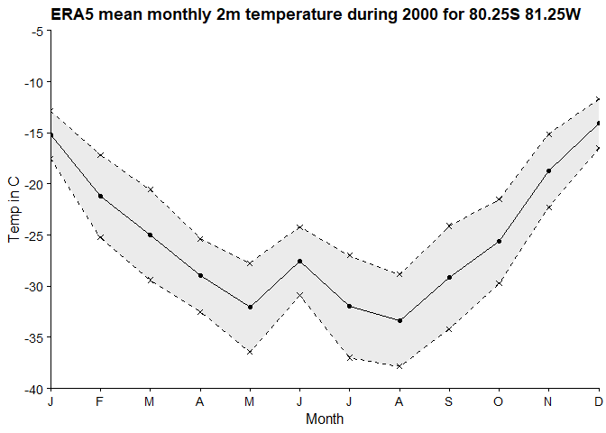

This package provides a set of simple handling functions for
downloading, importing, parsing, and summarising ERA5 netcdf4 files
downloaded from the copernicus climate data store (CDS). It has been
tested using single levels and pressure levels data, with files
downloaded both manually and through API methods such as
[ecmwfr](https://github.com/bluegreen-labs/ecmwfr).

A simple workflow is outlined below.

1)  Create an account on the Copernicus CDS

- Go to the [Copernicus
  CDS](https://cds.climate.copernicus.eu/cdsapp#!/home) and create an
  account.

2)  Download ERA5 netcdf4 data

- You can do this either [manually from the
  CDS](https://cds.climate.copernicus.eu/cdsapp#!/search?type=dataset&text=ERA5)
  or via the API - see steps below.

- Install and load the `ERA5handlers` package. This package and its
  dependencies can be fetched with the devtools package, using
  `devtools::install_github("MRPHarris/ERA5handlers")`

- Get your API key from the CDS (click on your profile and scroll down).

- The `get_CDS_era5()` function provides a simple mechanism (a wrapper
  for [ecmwfr::wf_request](https://github.com/bluegreen-labs/ecmwfr)) to
  submit sequential requests to the CDS for ERA-5 data. In the example
  below, I submit requests to download 2m temperature and total
  precipitation data for a small area over Roosevelt Island on the Ross
  Ice Shelf covering 01/01/1990 - 31/12/1991. The data will be left as a
  series of monthly .nc files in the specified directory. Any data
  downloaded as a .zip will be unzipped, renamed, and then the archive
  deleted.

``` r
export_dir = "C:/send/files/here"
get_CDS_era5(key = "0000-I'm-not-going-to-show-my-API-key-here",
             user = "m.harris@gns.cri.nz",
             archive = TRUE,
             dataset = "reanalysis-era5-single-levels",
             coords = c(-79.25, -161.75, -79.5, -161.5), # NWSE, RICE coords
             variables = c("2m_temperature","total_precipitation"),
             by = "month",
             start_YYYYMM = "199001",
             end_YYYYMM = "199212",
             identifier = "RICE",
             download_directory = export_dir)
```

3)  Import desired files into R

- The `collate_era5()` function imports and parses ERA5 netcdf4 files.
  The package ships with a small netcdf4 file containing 2m temperature
  data from 2000, used in line with the Copernicus
  [license](https://cds.climate.copernicus.eu/api/v2/terms/static/licence-to-use-copernicus-products.pdf).
  The data includes the grid points lat = c(-80.00 -80.25 -80.50) and
  lon = c(-81.50 -81.25 -81.00 -80.75 -80.50), covering a small portion
  of the southern Ellsworth Mountains in Antarctica.

In this case, we use `collate_era5()` to read in the single file, and
narrow the coordinates to a single grid point.

``` r
# Load package
library(ERA5handlers)
# Specify local data store
dat_store_era5 <- paste0(here(),"/data-raw/")
# Get filenames in store
era5_fnames <- list.files(dat_store_era5, full.names = TRUE)
# Get target era5 file
temp2m_2000_PH <- collate_era5(era5_fnames, string = 'temp2m_2000', coords = c(-80.25, -81.25))
head(temp2m_2000_PH)
```

    #> # A tibble: 6 × 12
    #>   value       lon    lat timestamp           name  coord  year month   day  hour
    #>   <dbl> <dbl[1d]> <dbl[> <dttm[1d]>          <fct> <fct> <dbl> <dbl> <dbl> <dbl>
    #> 1  259.     -81.2  -80.2 2000-01-01 00:00:00 t2m   -81.…  2000     1     1     0
    #> 2  258.     -81.2  -80.2 2000-01-01 01:00:00 t2m   -81.…  2000     1     1     1
    #> 3  258.     -81.2  -80.2 2000-01-01 02:00:00 t2m   -81.…  2000     1     1     2
    #> 4  257.     -81.2  -80.2 2000-01-01 03:00:00 t2m   -81.…  2000     1     1     3
    #> 5  257.     -81.2  -80.2 2000-01-01 04:00:00 t2m   -81.…  2000     1     1     4
    #> 6  257.     -81.2  -80.2 2000-01-01 05:00:00 t2m   -81.…  2000     1     1     5
    #> # ℹ 2 more variables: month_seq <dbl>, day_seq <dbl>

4)  Go nuts

Imported data can now be analysed freely. A simple monthly value
aggregator is provided in `monthmeans_era5()`, which will determine the
monthly mean or standard deviation for the value in a given given field
within an ERA5 file. Months can be extracted from a single year, or
across multiple years.

``` r
# Derive month means. Single year.
PH_temp_monthmeans <- monthmeans_era5(temp2m_2000_PH, total_months = TRUE) %>%
  mutate(month_varmean = month_varmean - 273.15) # K to C conversion
# Plot the monthly temperature means at this grid point for 1999, with standard devations
sd_polygon_avtemp <- data.frame(x = c(rep(PH_temp_monthmeans$month), 
                                      rev(rep(PH_temp_monthmeans$month))), 
                                y = c(PH_temp_monthmeans$month_varmean + PH_temp_monthmeans$month_varsd, 
                                      rev(PH_temp_monthmeans$month_varmean - PH_temp_monthmeans$month_varsd)))
month_labs <- c("J","F","M","A","M","J","J","A","S","O","N","D")
ggplot() +
  # SD polygon
  geom_polygon(data = sd_polygon_avtemp, aes(x = x, y = y), fill = "grey60", colour = "NA", alpha = 0.2) +
  # Avtemp
  geom_line(data = PH_temp_monthmeans, aes(x = month, y = month_varmean)) +
  geom_point(data = PH_temp_monthmeans, aes(x = month, y = month_varmean)) +
  # SD: upper
  geom_line(data = PH_temp_monthmeans, aes(x = month, y = month_varmean + month_varsd), linetype = 'dashed') +
  geom_point(data = PH_temp_monthmeans, aes(x = month, y = month_varmean + month_varsd), shape = 4) +
  # SD: lower
  geom_line(data = PH_temp_monthmeans, aes(x = month, y = month_varmean - month_varsd), linetype = 'dashed') +
  geom_point(data = PH_temp_monthmeans, aes(x = month, y = month_varmean - month_varsd), shape = 4) +
  # themes etc.
  scale_x_continuous(breaks = seq(1,12,1), labels = month_labs, expand = c(0,0)) +
  scale_y_continuous(expand = c(0,0), limits = c(-40,-5), breaks = seq(-40,-5,5)) +
  labs(x = "Month", y = "Temp in C") +
  ggtitle('ERA5 mean monthly 2m temperature during 2000 for 80.25S 81.25W') +
  theme_cowplot(12)
```


